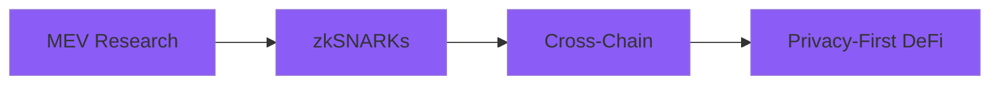

<div align="center">

# 👋 Himanshu D Dhandole

**Blockchain Engineer** · **DeFi** · **Full-Stack Builder**

```ascii
██████╗ ███████╗███████╗██╗    
██╔══██╗██╔════╝██╔════╝██║    
██║  ██║█████╗  █████╗  ██║    
██║  ██║██╔══╝  ██╔══╝  ██║    
██████╔╝███████╗██║     ██║    
╚═════╝ ╚══════╝╚═╝     ╚═╝    
```

[](mailto:dhandolehimanshu@gmail.com)
[](your-linkedin)
[]()

</div>

---

## 🎯 What I Do

```solidity
// SPDX-License-Identifier: MIT
pragma solidity ^0.8.0;

contract Himanshu {
    string public constant ROLE = "DeFi Protocol Engineer";
    
    function expertise() external pure returns (string[] memory) {
        return ["Solidity", "Protocol Design", "MEV", "Yield Systems"];
    }
}
```

I build **capital-efficient DeFi infrastructure** — perpetual exchanges, yield optimizers, and automated market makers that handle **real money** on-chain.

---

## 🛠️ Tech Stack & Tools

<div align="center">

### Blockchain
<p>


</p>

### Backend & Databases
<p>


</p>

### Frontend
<p>


</p>

### Tools
<p>


</p>

</div>


---

## 🚀 Featured Projects

<table>
<tr>
<td width="50%" valign="top">

### 🔥 PERP-EX
**On-Chain Perpetual Exchange**

```typescript
const features = {
  positions: "ERC-1155 NFTs",
  pricing: "vAMM Model",
  liquidation: "Automated",
  monitoring: "Real-time Indexer"
};
```

**Tech:** Solidity, Foundry, Chainlink  
**Highlight:** Transferable NFT positions with autonomous liquidation engine

</td>
<td width="50%" valign="top">

### 🧠 FLEXI-YIELD
**AI-Driven Yield Optimizer**

```python
def optimize_yield():
    best_apy = ml_model.predict()
    vault.rebalance(best_apy)
    return "Capital Efficiency ↑"
```

**Tech:** ERC-4626, Python ML, EIP-712  
**Highlight:** Auto-rebalancing vaults with ML-based APY prediction

</td>
</tr>
</table>

---

## 📊 GitHub Analytics

<div align="center">
  

  
</div>

<div align="center">
  

  
</div>


---

## 🏆 Achievements

<div align="center">

| 🥈 **Technex Hackathon 2025** | 🥉 **Enkryptia Hackathon 2024** |
|:---:|:---:|
| *1st Runner-Up* | *2nd Runner-Up* |
| LeafLink Platform | Mentorship Platform |

</div>

---

## 🎓 Current Focus



* **MEV & Order-Flow** - Understanding value extraction mechanics
* **zkSNARKs** - Privacy-preserving DeFi protocols
* **Cross-Chain** - Secure messaging & settlement layers

---

## 💼 Open To

✅ Core protocol engineering roles  
✅ Early-stage Web3 startups  
✅ Research-heavy DeFi builds  
✅ High-stakes hackathons  

---

<div align="center">

### 📫 Let's Build Together

[](mailto:dhandolehimanshu@gmail.com)
[](https://www.linkedin.com/in/himanshu-dhandole/)

---

**"Coding without music is a MISTAKE"**

</div>

---
